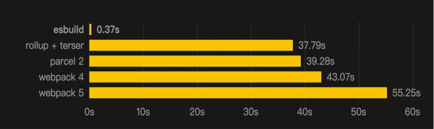
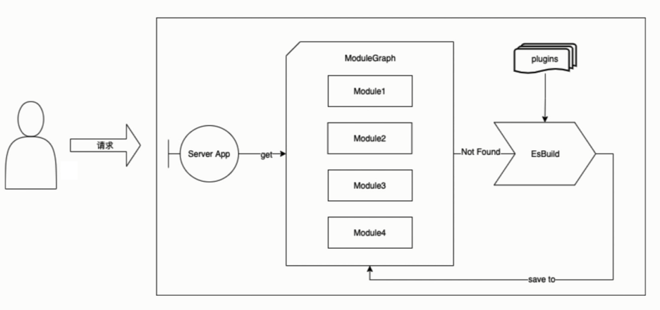

# 前置目标

- 官方文档：https://cn.vitejs.dev/
- awesome-vite：https://github.com/vitejs/awesome-vite

特点：

- 极速的服务启动
  - 使用原生 ESM 文件，无需打包!
- 轻量快速的热重载
  - 无论应用程序大小如何，都始终极快的模块热重载（HMR）
- 丰富的功能
  - 对 TypeScript、JSX、CSS 等支持开箱即用。
- 优化的构建
  - 可选 “多页应用” 或 “库” 模式的预配置 Rollup 构建
- 通用的插件
  - 在开发和构建之间共享 Rollup-superset 插件接口。
- 完全类型化的 API
  - 灵活的 API 和完整 TypeScript 类型。

## 目标

- 掌握 vite 使用
- 理解 vite 原理
- 构建对于前端构建的认知

## 构建是现在前端逃不开的话题

- 前端框架时代
- 前端应用越来越复杂
- 学习构建就是提升自己的重要的过程

## 内容

- vite 使用
  - 各种前端框架集成
  - CSS、图片、Wasm 之类的第三方资源加载
  - TS、JSX 不同语法集成
  - glob import
  - 预编译文件
  - 后端集成
- vite 插件开发和实战
  - rollup、esbuild 学习
  - vite 插件 API 学习
  - 官方插件示例
  - 让 vite 集成 mdx
- vite 源码解析
  - vite 性能如此出色的原因
  - vite 的 HMR 如何实现
  - 服务端渲染原理

