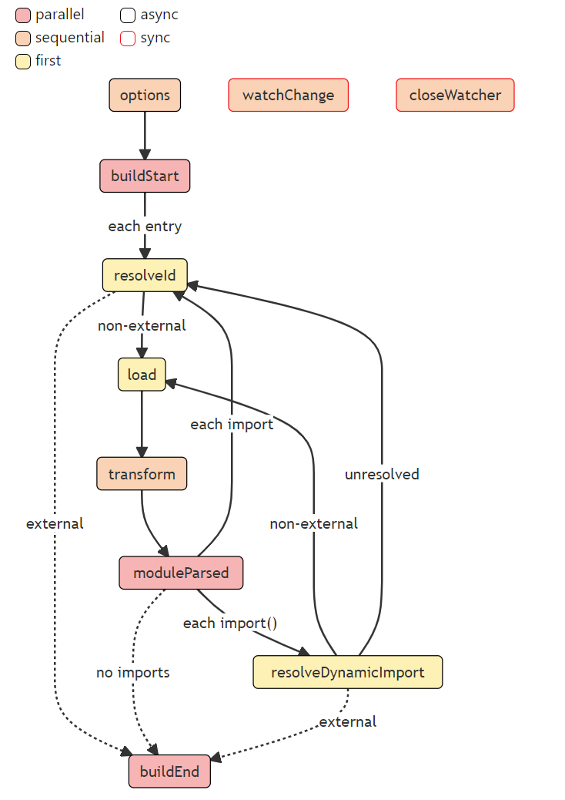
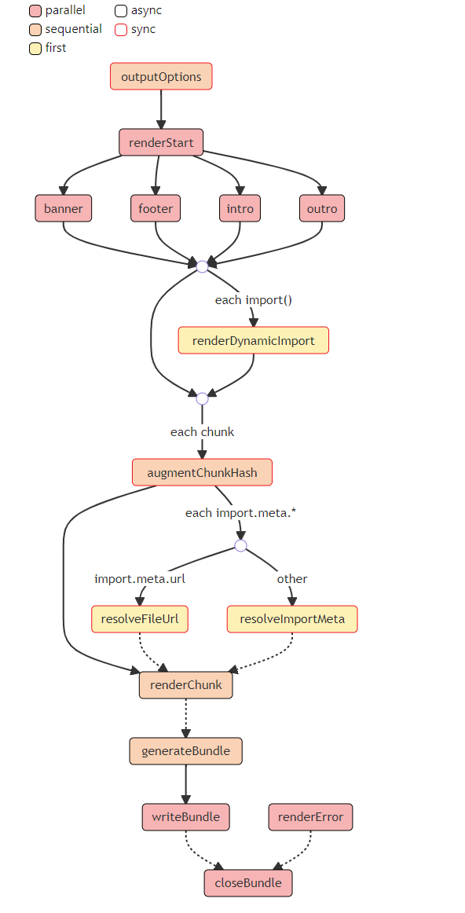

# Rollup 插件功能解析

## Rollup 插件

流程：

```txt
Input -> rollup main -> Plugin1 -> Plugin2 -> .... -> PluginX -> Emit file -> Finish
```

## Build Hooks

https://rollupjs.org/guide/en/#build-hooks



## Output Generation Hooks



内置的一些 Hook：文档：

- options
- buildStart
- resolveId
- transform

## 通用配置

- include
- exclude

## 三个官方插件

- alias
- babel
- replace

**大部分的插件可以直接在 vite 中使用**

## alias

源代码：https://github.com/rollup/plugins/blob/master/packages/alias/src/index.ts

```ts
// 省略前置代码

export default function alias(options: RollupAliasOptions = {}): Plugin {
    // options 插件的配置参数
  const entries = getEntries(options);

  if (entries.length === 0) {
    return {
      name: 'alias',
      resolveId: noop
    };
  }

  return {
    name: 'alias',
    // Hook：buildStart
    // inputOptions：Rollup 的整体配置
    buildStart(inputOptions) {
      return Promise.all(
        [...entries, options].map(
          ({ customResolver }) =>
            customResolver &&
            typeof customResolver === 'object' &&
            typeof customResolver.buildStart === 'function' &&
            customResolver.buildStart.call(this, inputOptions)
        )
      ).then(() => {
        // enforce void return value
      });
    },
    // Hook：resolveId ，核心 Hook
    // importee  （提供者） ；importer：（消费者）那个文件中引用的这个文件
    resolveId(importee, importer) {
      const importeeId = normalizeId(importee);
      const importerId = normalizeId(importer);

      // First match is supposed to be the correct one
      const matchedEntry = entries.find((entry) => matches(entry.find, importeeId));
      if (!matchedEntry || !importerId) {
        return null;
      }

      const updatedId = normalizeId(
        importeeId.replace(matchedEntry.find, matchedEntry.replacement)
      );

      const customResolver = getCustomResolver(matchedEntry, options);
      if (customResolver) {
        return customResolver.call(this, updatedId, importerId, {});
      }

      return this.resolve(updatedId, importer, { skipSelf: true }).then((resolved) => {
        let finalResult: PartialResolvedId | null = resolved;
        if (!finalResult) {
          finalResult = { id: updatedId };
        }

        return finalResult;
      });
    }
  };
}
```

## babel

源码：
- https://github.com/rollup/plugins/blob/master/packages/babel/README.md
- https://github.com/rollup/plugins/blob/master/packages/babel/src/index.js
- https://github.com/rollup/plugins/blob/master/packages/babel/src/transformCode.js

Hook：
- options
- transform
- renderStart
- renderChunk

## replace

- 源码：https://github.com/rollup/plugins/blob/master/packages/replace/src/index.js

```js
  return {
    name: 'replace',

    buildStart() {
      if (![true, false].includes(preventAssignment)) {
        this.warn({
          message:
            "@rollup/plugin-replace: 'preventAssignment' currently defaults to false. It is recommended to set this option to `true`, as the next major version will default this option to `true`."
        });
      }
    },

    renderChunk(code, chunk) {
      const id = chunk.fileName;
      if (!keys.length) return null;
      if (!filter(id)) return null;
      return executeReplacement(code, id);
    },

    transform(code, id) {
      if (!keys.length) return null;
      if (!filter(id)) return null;
      return executeReplacement(code, id);
    }
  };
```
