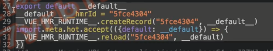

# vite-vue-jsx 插件

## vite-vue-jsx 插件概览

- vite-vue-jsx ：https://github.com/vitejs/vite/blob/main/packages/plugin-vue-jsx

- vue-jsx-next：https://github.com/vuejs/jsx-next

```bash
npm install @vue/babel-plugin-jsx -D
```

.babelrc
```js
{
  "plugins": ["@vue/babel-plugin-jsx"]
}
```

## vite-vue-jsx 插件源码解析之配置和产出

- 核心：vueJsxPlugin

```js
function vueJsxPlugin(options = {}) {
  let root = ''
  let needHmr = false
  let needSourceMap = true

  return {
    name: 'vue-jsx',

    config(config) {
      return {
        // only apply esbuild to ts files
        // since we are handling jsx and tsx now
        esbuild: {
          include: /\.ts$/
        },
        define: {
          __VUE_OPTIONS_API__: true,
          __VUE_PROD_DEVTOOLS__: false,
          ...config.define
        }
      }
    },

    configResolved(config) {
      needHmr = config.command === 'serve' && !config.isProduction
      needSourceMap = config.command === 'serve' || !!config.build.sourcemap
      root = config.root
    },

    resolveId(id) {
      if (id === ssrRegisterHelperId) {
        return id
      }
    },

    load(id) {
      if (id === ssrRegisterHelperId) {
        return ssrRegisterHelperCode
      }
    },

    transform(code, id, ssr) {
        // ...
  }
}
```

transform

```js
    transform(code, id, ssr) {
      const {
        include,
        exclude,
        babelPlugins = [],
        ...babelPluginOptions
      } = options

      const filter = createFilter(include || /\.[jt]sx$/, exclude)

      if (filter(id)) {
        const plugins = [importMeta, [jsx, babelPluginOptions], ...babelPlugins]
        if (id.endsWith('.tsx')) {
          plugins.push([
            require('@babel/plugin-transform-typescript'),
            // @ts-ignore
            { isTSX: true, allowExtensions: true }
          ])
        }

        const result = babel.transformSync(code, {
          babelrc: false,
          ast: true,
          plugins,
          sourceMaps: needSourceMap,
          sourceFileName: id,
          configFile: false
        })

        if (!ssr && !needHmr) {
          return {
            code: result.code,
            map: result.map
          }
        }

        // check for hmr injection
        /**
         * @type {{ name: string }[]}
         */
        const declaredComponents = []
        /**
         * @type {{
         *  local: string,
         *  exported: string,
         *  id: string,
         * }[]}
         */
        const hotComponents = []
        let hasDefault = false

        for (const node of result.ast.program.body) {
          if (node.type === 'VariableDeclaration') {
            const names = parseComponentDecls(node, code)
            if (names.length) {
              declaredComponents.push(...names)
            }
          }

          if (node.type === 'ExportNamedDeclaration') {
            if (
              node.declaration &&
              node.declaration.type === 'VariableDeclaration'
            ) {
              hotComponents.push(
                ...parseComponentDecls(node.declaration, code).map(
                  ({ name }) => ({
                    local: name,
                    exported: name,
                    id: hash(id + name)
                  })
                )
              )
            } else if (node.specifiers.length) {
              for (const spec of node.specifiers) {
                if (
                  spec.type === 'ExportSpecifier' &&
                  spec.exported.type === 'Identifier'
                ) {
                  const matched = declaredComponents.find(
                    ({ name }) => name === spec.local.name
                  )
                  if (matched) {
                    hotComponents.push({
                      local: spec.local.name,
                      exported: spec.exported.name,
                      id: hash(id + spec.exported.name)
                    })
                  }
                }
              }
            }
          }

          if (node.type === 'ExportDefaultDeclaration') {
            if (node.declaration.type === 'Identifier') {
              const _name = node.declaration.name
              const matched = declaredComponents.find(
                ({ name }) => name === _name
              )
              if (matched) {
                hotComponents.push({
                  local: node.declaration.name,
                  exported: 'default',
                  id: hash(id + 'default')
                })
              }
            } else if (isDefineComponentCall(node.declaration)) {
              hasDefault = true
              hotComponents.push({
                local: '__default__',
                exported: 'default',
                id: hash(id + 'default')
              })
            }
          }
        }

        if (hotComponents.length) {
          if (hasDefault && (needHmr || ssr)) {
            result.code =
              result.code.replace(
                /export default defineComponent/g,
                `const __default__ = defineComponent`
              ) + `\nexport default __default__`
          }

          if (needHmr && !ssr) {
            let code = result.code
            let callbackCode = ``
            for (const { local, exported, id } of hotComponents) {
              code +=
                `\n${local}.__hmrId = "${id}"` +
                `\n__VUE_HMR_RUNTIME__.createRecord("${id}", ${local})`
              callbackCode += `\n__VUE_HMR_RUNTIME__.reload("${id}", __${exported})`
            }

            code += `\nimport.meta.hot.accept(({${hotComponents
              .map((c) => `${c.exported}: __${c.exported}`)
              .join(',')}}) => {${callbackCode}\n})`

            result.code = code
          }

          if (ssr) {
            const normalizedId = normalizePath(path.relative(root, id))
            let ssrInjectCode =
              `\nimport { ssrRegisterHelper } from "${ssrRegisterHelperId}"` +
              `\nconst __moduleId = ${JSON.stringify(normalizedId)}`
            for (const { local } of hotComponents) {
              ssrInjectCode += `\nssrRegisterHelper(${local}, __moduleId)`
            }
            result.code += ssrInjectCode
          }
        }

        return {
          code: result.code,
          map: result.map
        }
      }
    }
```

## vite-vue-jsx 插件详解之 HMR

js 转 ast 的网站：https://astexplorer.net/



```js
        // check for hmr injection
        /**
         * @type {{ name: string }[]}
         */
        const declaredComponents = []
        /**
         * @type {{
         *  local: string,
         *  exported: string,
         *  id: string,
         * }[]}
         */
        const hotComponents = []
        let hasDefault = false

        for (const node of result.ast.program.body) {
          if (node.type === 'VariableDeclaration') {
            const names = parseComponentDecls(node, code)
            if (names.length) {
              declaredComponents.push(...names)
            }
          }

          if (node.type === 'ExportNamedDeclaration') {
            if (
              node.declaration &&
              node.declaration.type === 'VariableDeclaration'
            ) {
              hotComponents.push(
                ...parseComponentDecls(node.declaration, code).map(
                  ({ name }) => ({
                    local: name,
                    exported: name,
                    id: hash(id + name)
                  })
                )
              )
            } else if (node.specifiers.length) {
              for (const spec of node.specifiers) {
                if (
                  spec.type === 'ExportSpecifier' &&
                  spec.exported.type === 'Identifier'
                ) {
                  const matched = declaredComponents.find(
                    ({ name }) => name === spec.local.name
                  )
                  if (matched) {
                    hotComponents.push({
                      local: spec.local.name,
                      exported: spec.exported.name,
                      id: hash(id + spec.exported.name)
                    })
                  }
                }
              }
            }
          }

          if (node.type === 'ExportDefaultDeclaration') {
            if (node.declaration.type === 'Identifier') {
              const _name = node.declaration.name
              const matched = declaredComponents.find(
                ({ name }) => name === _name
              )
              if (matched) {
                hotComponents.push({
                  local: node.declaration.name,
                  exported: 'default',
                  id: hash(id + 'default')
                })
              }
            } else if (isDefineComponentCall(node.declaration)) {
              hasDefault = true
              hotComponents.push({
                local: '__default__',
                exported: 'default',
                id: hash(id + 'default')
              })
            }
          }
        }

        if (hotComponents.length) {
          if (hasDefault && (needHmr || ssr)) {
            result.code =
              result.code.replace(
                /export default defineComponent/g,
                `const __default__ = defineComponent`
              ) + `\nexport default __default__`
          }

          if (needHmr && !ssr) {
            let code = result.code
            let callbackCode = ``
            for (const { local, exported, id } of hotComponents) {
              code +=
                `\n${local}.__hmrId = "${id}"` +
                `\n__VUE_HMR_RUNTIME__.createRecord("${id}", ${local})`
              callbackCode += `\n__VUE_HMR_RUNTIME__.reload("${id}", __${exported})`
            }

            code += `\nimport.meta.hot.accept(({${hotComponents
              .map((c) => `${c.exported}: __${c.exported}`)
              .join(',')}}) => {${callbackCode}\n})`

            result.code = code
          }
```

## vite-vue-jsx 插件解析之 SSR

```js
const ssrRegisterHelperId = '/__vue-jsx-ssr-register-helper'
const ssrRegisterHelperCode =
  `import { useSSRContext } from "vue"\n` +
  `export ${ssrRegisterHelper.toString()}`

/**
 * This function is serialized with toString() and evaluated as a virtual
 * module during SSR
 * @param {import('vue').ComponentOptions} comp
 * @param {string} filename
 */
function ssrRegisterHelper(comp, filename) {
  const setup = comp.setup
  comp.setup = (props, ctx) => {
    // @ts-ignore
    const ssrContext = useSSRContext()
    ;(ssrContext.modules || (ssrContext.modules = new Set())).add(filename)
    if (setup) {
      return setup(props, ctx)
    }
  }
}
```

```js
          if (ssr) {
            const normalizedId = normalizePath(path.relative(root, id))
            let ssrInjectCode =
              `\nimport { ssrRegisterHelper } from "${ssrRegisterHelperId}"` +
              `\nconst __moduleId = ${JSON.stringify(normalizedId)}`
            for (const { local } of hotComponents) {
              ssrInjectCode += `\nssrRegisterHelper(${local}, __moduleId)`
            }
            result.code += ssrInjectCode
          }
```
