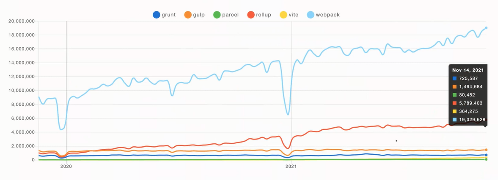
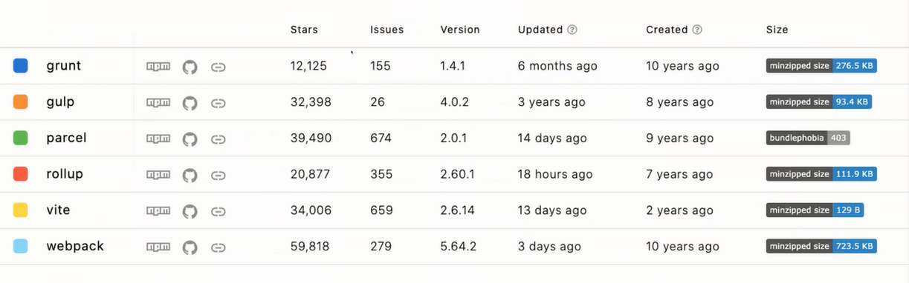
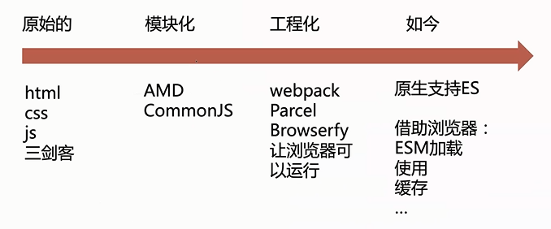
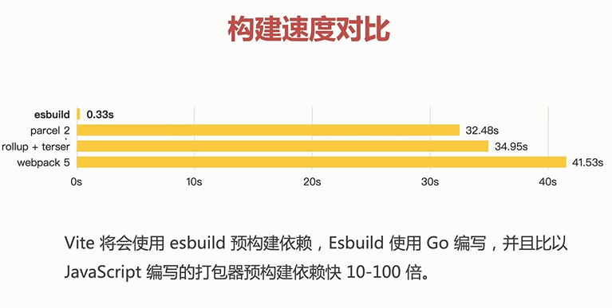

# 直播笔记：深入源码解读下一代前端工具Vite 

- 你了解到的前端工程化工具有哪些？
- 你能说出这些前端工程化工具的前世今生吗？（优缺点）
- 你知道的哪些优秀的前端库是怎么做出来的？

读源码的好处：
- 提升编码能力
- **提升编程思维**
- 大厂面试偏爱

Vite（法语意为 "快速的"，发音 /vit/，发音同 "veet"）是一种新型前端构建工具，能够显著提升前端开发体验。

## 目录

- 主流工程化工具对比，Vite应用场景及旧项目改造前提
- 开源项目如何读源码（从环境到调试）
- 上手Vite，工程化扩展 rollup

前端工程化 - 长江后浪推前浪

## 主流前端工程化构建工具

- webapck & gulkp 是目前主流的工程化工具
- 零配置 parcel，ES 模块构建工具 rollup
- `vite 基于 rollup（编译）。提供 devServer，封装高级 API`

## 对比 webpack vs vite

- vite 集成 devServer
- vite 减少了 loaders 配置，内置资源的处理
- `vite 对 TS 更友好，对 ES6+ 更好友`

## 上手 vite 容易吗

- 容易，但也有限制

优势：
- 配置简单，易上手
- 开发效率高，启动快
- `生态丰富，兼容 rollup ，易扩展`

## 旧项目 or 新项目

- Vite 也是支持 vue2
- Vite 对 node 后端打包： vite-plugin-node（第三方）
- Vite ssr 实验阶段，建议 NUxt & Next

Vite 要革 webpack 的命

## Vite 的工作原理

- Vite 为什么快

Vite 要解决的核心问题是反复循环的

你是否有如下项目，特别是大项目
- 打包非常慢，大概分钟级
- 热更新，编译需要几秒
- 热更新完成，页面需要几秒更新

## 历史的车轮滚滚前进

## Vite 更“快”的原因

- Vite 以原生 ESM 的方式提供源码
- Vite 只在浏览器请求源码时进行转换
- Vite 利用 HTTP 头来加速重载，充分利用浏览器缓存

